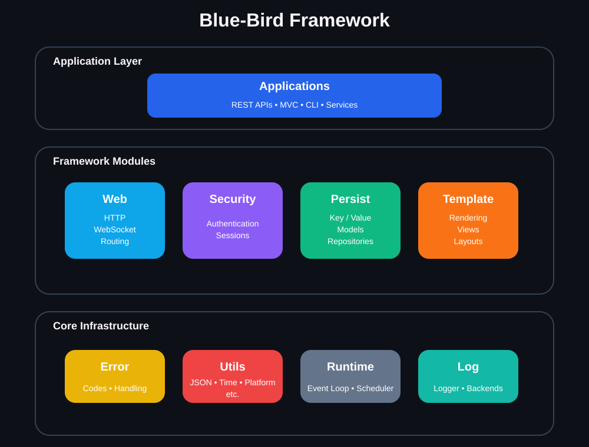
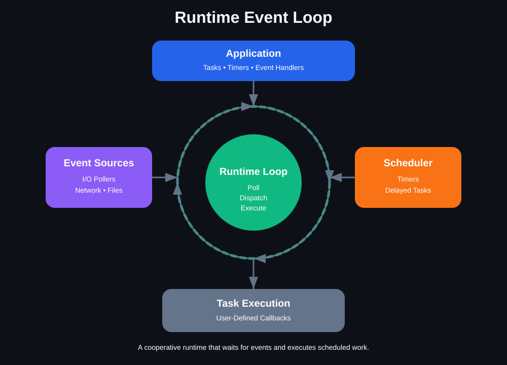
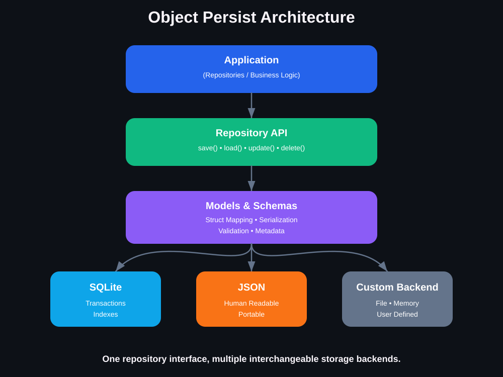
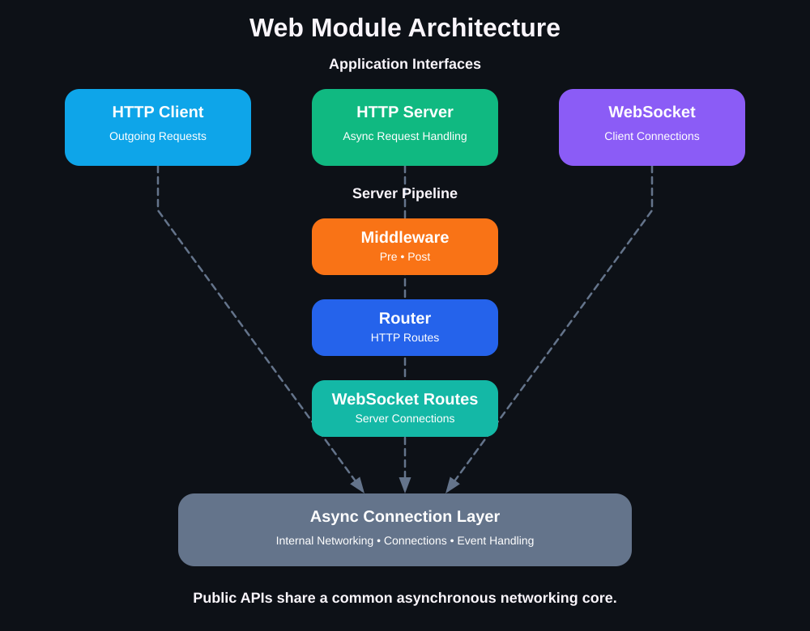

# Architecture

Blue-Bird is organized as a collection of independent modules with well-defined responsibilities and one-way dependency relationships.

Rather than being a single monolithic framework, Blue-Bird is designed as a backend ecosystem. Each module solves a specific problem and can be used independently whenever possible.

---

# Architectural Principles

Blue-Bird follows several core architectural principles:

* **Modular design**
* **Explicit APIs**
* **Clear dependency direction**
* **Minimal coupling**
* **Backend-agnostic abstractions**
* **No hidden runtime behavior**
* **Testable components**

Each module exposes a public API through its `include/` directory while keeping implementation details inside `internal/` and `src/`.

---

# Module Overview



## Error

The `error` module provides framework-wide error handling primitives.

Responsibilities include:

* standardized error types
* error codes
* assertion utilities

Every other module depends on this module.

---

## Utils

The `utils` module contains reusable low-level infrastructure that does not belong to any specific subsystem.

It currently provides:

* JSON parser and serializer
* UUID utilities
* hashing
* encoding helpers
* time utilities
* platform abstractions
* configuration helpers
* asset loading

This module intentionally has very few dependencies and serves as common infrastructure for the rest of the framework.

---

## Runtime



The `runtime` module provides Blue-Bird's asynchronous execution engine.

It implements:

* cooperative task scheduling
* event loop execution
* file descriptor watching
* timers
* asynchronous event dispatch

The runtime is transport-agnostic and can be used independently of the web framework.

---

## Persist



The `persist` module provides storage abstractions for backend applications.

Features include:

* key-value persistence
* schema-driven object persistence
* repository APIs
* serialization
* pluggable persistence backends

Current backends include:

* File
* JSON
* SQLite

Applications interact with repositories and models instead of backend implementations.

---

## Template

The `template` module provides a lightweight rendering engine.

It currently supports:

* variable interpolation
* nested lookup
* sections
* conditionals
* comments
* escaped delimiters

Although primarily intended for HTML generation, the template engine is designed to be generic and can be used for configuration files, code generation, emails, or any text-based output.

---

## Log

The `log` module provides extensible logging infrastructure.

Features include:

* configurable log levels
* console logger
* persistence-backed logger
* pluggable logging backends

Logging is independent from application code and integrates naturally with the persistence module.

---

## Security

The `security` module provides authentication-related building blocks.

It currently includes:

* password hashing and verification
* session management
* authentication helpers
* pluggable password backends
* configurable session storage

The module is storage-agnostic and can be integrated with different persistence mechanisms.

---

## Web



The `web` module provides networking and application-layer infrastructure.

Major components include:

* HTTP server
* HTTP client
* WebSocket server
* WebSocket client
* routing
* middleware
* request/response abstractions
* asynchronous connections

The web module is built on top of the runtime and provides the primary interface for building networked applications.

---

# Dependency Direction

Blue-Bird enforces one-way dependencies between modules.

Higher-level modules may depend on lower-level modules, but lower-level modules must never depend on higher-level ones.

The exact dependencies evolve as the framework grows, but the guiding principle remains the same:

* dependencies always point downward
* infrastructure modules never depend on application modules
* public APIs remain independent of implementation details

This architecture keeps modules reusable and prevents cyclic dependencies.

---

# Request Lifecycle

Incoming HTTP requests follow a predictable processing pipeline.

```txt
Client
   │
   ▼
HTTP Server
   │
   ▼
Middleware Pipeline
   │
   ▼
Router
   │
   ▼
Route Handler
   │
   ▼
Response
   │
   ▼
Client
```

For asynchronous applications, request processing is coordinated by the runtime event loop.

---

# WebSocket Lifecycle

A WebSocket connection progresses through several stages.

```txt
TCP Connection
      │
      ▼
HTTP Upgrade
      │
      ▼
WebSocket Handshake
      │
      ▼
Frame Processing
      │
      ▼
Application Callbacks
      │
      ▼
Connection Close
```

Internally, asynchronous connections and the runtime cooperate to provide non-blocking communication.

---

# Persistence Flow

Object persistence is built around schemas and repositories.

```txt
Application Object
        │
        ▼
Schema
        │
        ▼
Repository
        │
        ▼
Model API
        │
        ▼
Persistence Backend
        │
        ▼
Storage
```

Applications remain independent of the underlying storage implementation.

---

# Internal vs Public APIs

Every module follows the same organizational pattern.

```txt
module/
├── include/     Public API
├── internal/    Internal implementation headers
├── src/         Implementation
└── tests/       Unit and integration tests
```

Only headers under `include/` are considered part of the public API.

Everything inside `internal/` is an implementation detail and may change between releases.

---

# Testing Architecture

Testing is organized per module.

Each module owns its own tests:

* **Unit tests** verify individual components in isolation.
* **Integration tests** verify interactions between the public components of that module.

This organization keeps tests close to the code they validate while allowing the project-wide build system to discover and execute all tests through CTest.

Future project-wide integration tests that span multiple modules may be added if dedicated cross-module behavior is introduced.

---

# Extensibility

Blue-Bird is designed around pluggable interfaces.

Current extension points include:

* persistence backends
* model backends
* logging backends
* password backends
* session storage
* middleware
* routing
* asynchronous event handlers

Additional modules and language bindings (such as C++ wrappers) can be built on top of these stable interfaces without modifying the core architecture.
